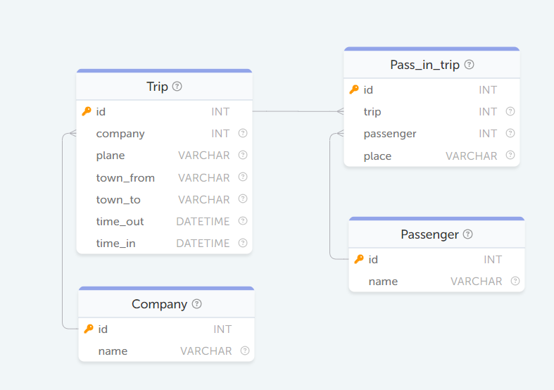

## SQL REQUESTS

## 1 Task 

#### Display sorted by number of flights (descending) 
#### and name (in ascending order) a list of passengers who have completed at least 1 flight

#### Вывести отсортированный по количеству перелетов (по убыванию)
#### и имени (по возрастанию) список пассажиров, совершивших хотя бы 1 полет. 

SELECT name , COUNT(trip) as count  from Passenger  
INNER JOIN Pass_in_trip on  
   Passenger.id=Pass_in_trip.passenger  
GROUP by name  
HAVING COUNT(trip)>0  
ORDER by count DESC, name ASC     

## 2 Task
#### Display the names of people who have a full namesake among the passengers  
#### Вывести имена людей, у которых есть полный тёзка среди пассажиров  

SELECT name  from Passenger  
GROUP BY name  
HAVING COUNT(*)>1  

## 3 Task

#### Display the passengers with the longest name. Spaces, hyphens, and periods are considered part of the name.  
#### Выведите пассажиров с самым длинным ФИО. Пробелы, дефисы и точки считаются частью имени.  
SELECT  name  
FROM Passenger  
WHERE LENGTH(name) = (  
    SELECT MAX(LENGTH(name))   
    FROM Passenger  
)  
## 4 Task

#### Display flights made from 10 a.m. to 2 p.m. January 1, 1900 
#### Вывести вылеты, совершенные с 10 ч. по 14 ч. 1 января 1900 г 

SELECT * from Trip  
WHERE time_OUT BETWEEN STR_TO_DATE('1900-01-01 10:00:00','%Y-%m-%d %H:%i:%s')  
                       AND   
                       STR_TO_DATE('1900-01-01 14:00:00','%Y-%m-%d %H:%i:%s')  

## 5 Task

##### 2 Tables:
1.	projects — с информацией о проектах: project_id, project_name, client_id.
2.	clients — с информацией о клиентах: client_id, client_name, country.
 
#### Display all projects that belong to clients from the country CANADA  
#### Вывести все проекты  , которые принадлежать клиентам из страны CANADA  

| WHERE IN                                                                                                   | JOIN ON                                                                                                                  |
|------------------------------------------------------------------------------------------------------------|--------------------------------------------------------------------------------------------------------------------------|
| SELECT * FROM projects   WHERE client_id IN  ( SELECT client_id FROM clients WHERE country="Canada") | SELECT * FROM projects   JOIN clients ON projects.client_id = clients.client_id   WHERE clients.country = "Canada" |

